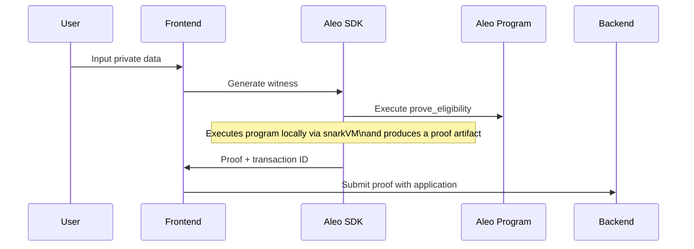
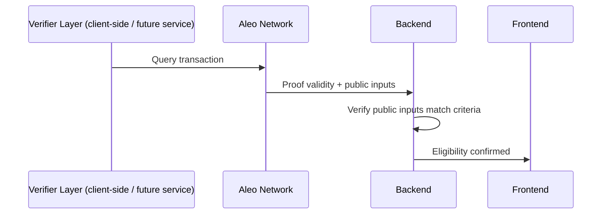

# Kloak

A privacy-preserving eligibility verification system built on Aleo blockchain, enabling zero-knowledge proof-based validation for distribution programs while maintaining user privacy.

## Architecture Overview

This project implements a zero-knowledge–verifiable eligibility verification mechanism using Aleo's zero-knowledge proof capabilities, consisting of two main components:

1. **Aleo Program** (`programs/eligibility`) - On-chain verification logic
2. **Next.js Frontend** (`next-app`) - User interface and application management

## Technical Stack

### Blockchain Layer
- **Aleo Leo** - Privacy-focused smart contract language
- **Zero-Knowledge Proofs** - SNARKs for private computation verification
- **Aleo Network** - Layer-1 blockchain with native ZK support

### Application Layer
- **Next.js 14+** - React framework with App Router
- **TypeScript** - Type-safe development
- **Provable SDK (planned)** - Proof execution and network interaction
- **Aleo Wallet Adapter** - Wallet connection
- **Local Storage** - Client-side state persistence

## Smart Contract Architecture

### Program: `eligibility.aleo`

```leo
program main.aleo {
    transition prove_eligibility(
        private contribution_count: u32,
        private joined_at: u64,
        min_contributions: u32,
        joined_before: u64,
    ) {
        assert(contribution_count >= min_contributions);
        assert(joined_at < joined_before);
    }
}
```

#### Function: `prove_eligibility`

**Purpose**: Generates a zero-knowledge proof that a user meets eligibility criteria without revealing their actual contribution count or join date.

**Parameters**:
- `contribution_count` (private u32) - User's actual contribution count
- `joined_at` (private u64) - User's join timestamp (Unix epoch)
- `min_contributions` (public u32) - Required minimum contributions
- `joined_before` (public u64) - Required join date threshold

**Privacy Model**:
- Private inputs remain encrypted on-chain
- Only boolean eligibility result is publicly verifiable
- Cryptographic proof validates computation without exposing data

**Verification Logic**:
1. Assert user's contributions meet/exceed minimum requirement
2. Assert user joined before specified threshold
3. Generate SNARK proof of valid computation

## Frontend Architecture

### Directory Structure

```
next-app/
├── app/
│   ├── apply/[id]/              # Application submission flow
│   │   ├── components/          # Form, verification, success states
│   │   └── utils/               # Distribution loading, mock verification
│   ├── dashboard/               # Distribution management
│   │   ├── [id]/                # Individual distribution details
│   │   ├── create/              # Multi-step distribution creation
│   │   └── components/          # Dashboard UI components
│   ├── lib/
│   │   ├── aleo/                # Aleo network configuration
│   │   ├── storage/             # Local storage abstractions
│   │   └── verifier/            # ZK proof verification logic
│   └── providers/
│       └── AleoWalletProvider.tsx  # Wallet context & connection
```

### Core Components

#### Application Flow (`/apply/[id]`)

**Components**:
- `EligibilityGate.tsx` - ZK proof generation interface
- `ApplicationForm.tsx` - User data collection
- `VerifyingState.tsx` - Proof generation loading state
- `SuccessState.tsx` - Submission confirmation

**Flow**:
1. User connects Aleo wallet
2. Inputs private eligibility data (contributions, join date)
3. Client generates ZK proof via Aleo SDK
4. Proof submitted with application
5. On-chain verification validates eligibility

#### Dashboard (`/dashboard`)

**Features**:
- Distribution creation (multi-step wizard)
- Application management
- Eligibility criteria configuration
- Applicant review interface

**Components**:
- `StepBasics.tsx` - Distribution metadata
- `StepEligibility.tsx` - Criteria configuration
- `StepReview.tsx` - Pre-deployment review
- `ApplicationsTable.tsx` - Applicant list with proof status

### State Management

#### Local Storage Schema

**Distributions** (`/lib/storage/distributions.ts`):
```typescript
{
  id: string
  name: string
  description: string
  eligibility: {
    minContributions: number
    joinedBefore: number  // Unix timestamp
  }
  createdAt: number
  status: 'draft' | 'active' | 'closed'
}
```

**Applications** (`/lib/storage/applications.ts`):
```typescript
{
  id: string
  distributionId: string
  applicantData?: {
  walletAddress?: string
}
  proof: string  // ZK proof transaction ID
  status: 'pending' | 'verified' | 'rejected'
  submittedAt: number
}
```

### Verification System

#### Mock Verifier (`/lib/verifier/mockVerifier.ts`)

Development-phase verifier simulating on-chain proof verification:

```typescript
async function verifyEligibilityProof(
  proof: string,
  publicInputs: {
    minContributions: number
    joinedBefore: number
  }
): Promise<boolean>
```

**Production Implementation**:
- Replace with Aleo SDK proof verification
- Query Aleo network for transaction status
- Validate proof against program execution

## Zero-Knowledge Proof Flow

### Proof Generation



### Proof Verification



## Setup & Installation

### Prerequisites

- Node.js 18+
- Aleo CLI tools
- Leo compiler (`leo`)

### Installation

```bash
# Clone repository
git clone <repository-url>
cd <repository-name>

# Install frontend dependencies
cd next-app
npm install

# Build Aleo program
cd ../programs/eligibility
leo build
```

### Configuration

#### Aleo Network Configuration (`next-app/app/lib/aleo/config.ts`)

```typescript
import { WalletAdapterNetwork } from "@demox-labs/aleo-wallet-adapter-base";

export const EXPECTED_NETWORK = WalletAdapterNetwork.Testnet;

```

### Development

```bash
# Start Next.js development server
cd next-app
npm run dev

# Deploy Aleo program (testnet)
cd programs/eligibility
leo deploy --network testnet3
```

## Integration Guide

### Wallet Integration

```typescript
import { AleoWalletProvider } from '@/providers/AleoWalletProvider'

// Wrap app with provider
<AleoWalletProvider>
  <YourApp />
</AleoWalletProvider>
```

### Proof Generation Example

```typescript
import { generateEligibilityProof } from '@/lib/verifier'

const proof = await generateEligibilityProof({
  contributionCount: 50,      // Private
  joinedAt: 1640000000,       // Private
  minContributions: 10,       // Public
  joinedBefore: 1650000000    // Public
})
```

### Verification Example

```typescript
import { verifyEligibilityProof } from '@/lib/verifier'

const isEligible = await verifyEligibilityProof(
  proof.transactionId,
  {
    minContributions: 10,
    joinedBefore: 1650000000
  }
)
```

## Privacy Guarantees

### What Remains Private
- Exact contribution count
- Precise join date
- Intermediate computation values

### What Is Public
- Eligibility criteria (minimums/thresholds)
- Proof validity (eligible/not eligible)
- Transaction existence on-chain

### Security Considerations

1. **Witness Privacy**: Private inputs never leave client-side execution
2. **Proof Soundness**: Cryptographically impossible to forge valid proof with invalid data
3. **Program Immutability**: `@noupgrade` decorator prevents logic changes post-deployment

## Performance Characteristics

### Proof Generation
- **Time**: ~5-10 seconds (local)
- **Size**: ~2KB serialized proof
- **Gas Cost**: ~100,000 microcredits (Aleo testnet)

### Verification
- **Time**: <1 second (on-chain)
- **Deterministic**: Same inputs always produce verifiable proofs

## Testing

### Unit Tests

```bash
# Test Aleo program
cd programs/eligibility
leo test

# Test frontend components
cd next-app
npm run test
```

### Integration Tests

```bash
# E2E testing with Playwright/Cypress
npm run test:e2e
```

## Deployment

### Aleo Program Deployment

```bash
cd programs/eligibility
leo deploy --network testnet3 --private-key <your-private-key>
```

### Frontend Deployment

```bash
cd next-app
npm run build
npm run start
```

Recommended platforms: Vercel, Netlify, or self-hosted with Docker.

## Roadmap

- [ ] Mainnet deployment
- [ ] Multi-criteria eligibility (OR/AND logic)
- [ ] Batch proof verification
- [ ] Encrypted application data storage
- [ ] On-chain application registry
- [ ] Token distribution automation
- [ ] Sybil resistance mechanisms


## License

TBD

## References

- [Aleo Documentation](https://developer.aleo.org/)
- [Leo Language Guide](https://docs.leo-lang.org/leo)
- [Zero-Knowledge Proofs](https://z.cash/technology/zksnarks/)

---


