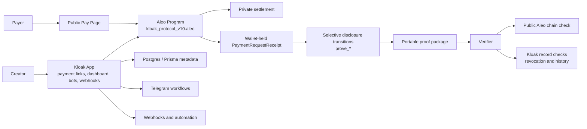

# Kloak

Kloak is an Aleo-native private payments and selective disclosure system.

It combines private payment links, wallet-held payment receipts, portable compliance proofs, public-chain verification, Telegram workflows, webhooks, and automation into a single operator-facing product built on Aleo.

## What Kloak is today

Kloak is not just a payment-link generator. The current system is built around three layers:

1. **Private settlement on Aleo**
   Payment requests are created and paid through the Aleo program in [programs/kloak_protocol/src/main.leo](./programs/kloak_protocol/src/main.leo).

2. **Receipt-backed selective disclosure**
   Private `PaymentRequestReceipt` records become the source of truth for payer- and receiver-side proofs.

3. **Chain-first verification**
   Shared proof packages are verified against public Aleo transactions first, with Kloak-managed records adding revocation and history checks on top.

For a technical changelog of the current branch, see [wave5_updates.md](./wave5_updates.md).

## Core product surfaces

- **Payment Links**
  Shareable payment requests with templates, redirects, suggested amounts, and private settlement.

- **Compliance**
  Generate selective disclosure proofs from wallet-held receipts and verify them with a portable proof package model.

- **Verification**
  Public Aleo chain checks are the primary trust signal. Kloak record checks are secondary and mainly add revocation and history status.

- **Telegram**
  Linked wallet notifications and operational workflows through the Kloak bot.

- **Webhooks and automation**
  Event delivery and heavier operational workflows for teams that need integrations and orchestration.

## Aleo-native architecture

Kloak is built to follow what Aleo actually exposes instead of pretending private arguments are publicly inspectable.


```mermaid
flowchart LR
    A["Creator"] --> B["Kloak App<br/>payment links, dashboard, bots, webhooks"]
    B --> C["Aleo Program<br/>kloak_protocol_v10.aleo"]
    U["Payer"] --> D["Public Pay Page"]
    D --> C
    C --> E["Private settlement"]
    C --> F["Wallet-held PaymentRequestReceipt"]
    F --> G["Selective disclosure transitions<br/>prove_*"]
    G --> H["Portable proof package"]
    H --> I["Verifier"]
    I --> J["Public Aleo chain check"]
    I --> K["Kloak record checks<br/>revocation and history"]
    B --> L["Postgres / Prisma metadata"]
    B --> M["Telegram workflows"]
    B --> N["Webhooks and automation"]
```

### On-chain program

The main protocol program is [programs/kloak_protocol/src/main.leo](./programs/kloak_protocol/src/main.leo).

Key transitions:

- `create_payment_request`
- `pay_request_aleo`
- `pay_request_usdcx`
- `pay_request_usad`
- `prove_payment_basic`
- `prove_payment_amount`
- `prove_payment_threshold`
- `prove_payment_timebox`
- `prove_receipt_basic`
- `prove_receipt_amount`
- `prove_receipt_threshold`
- `prove_receipt_timebox`

The program stores:

- `payment_requests`
- `payment_commitments`

and emits private `PaymentRequestReceipt` records for both payer and receiver.

### Off-chain app layer

The application lives in [next-app](./next-app) and handles:

- creator-facing product UX
- public pay pages
- proof packaging
- proof verification UX
- webhook delivery
- Telegram integration
- metadata and operational storage

### Verification model

Proof packaging and verification are centered in:

- [next-app/lib/selective-disclosure.ts](./next-app/lib/selective-disclosure.ts)
- [next-app/lib/portable-proof-verifier.ts](./next-app/lib/portable-proof-verifier.ts)
- [next-app/lib/aleo-chain-verifier.ts](./next-app/lib/aleo-chain-verifier.ts)
- [next-app/lib/services/selective-disclosure.service.ts](./next-app/lib/services/selective-disclosure.service.ts)

Kloak now treats verification as layered:

1. proof package integrity
2. public Aleo chain confirmation
3. Kloak-backed revocation and history checks

That trust model is intentional and matches what the product can actually prove today.

## Privacy model

Kloak is privacy-first, but it does not claim that every field everywhere is private.

What is private by design:

- settlement through Aleo private transfers
- payer and receiver receipts held in the wallet
- selective disclosure generated from those receipts
- payer identity remaining hidden by default at the product layer

What is not claimed as globally hidden:

- payment link metadata such as title or description
- all off-chain operational metadata
- all proof-type metadata on-chain

The current product emphasis is:

- **share payment requests openly if needed**
- **keep settlement and payer identity private by default**
- **reveal only the proof statement needed for compliance**

## Security hardening in the current branch

Recent hardening work focused on replacing trust in client-supplied addresses with signed wallet access and reducing overreliance on Kloak-managed state.

Relevant files:

- [next-app/lib/creator-access.ts](./next-app/lib/creator-access.ts)
- [next-app/lib/compliance-access.ts](./next-app/lib/compliance-access.ts)
- [next-app/lib/payment-chain-validation.ts](./next-app/lib/payment-chain-validation.ts)
- [next-app/app/api/payment-links/[id]/pay/route.ts](./next-app/app/api/payment-links/[id]/pay/route.ts)
- [next-app/app/api/proof/verify/route.ts](./next-app/app/api/proof/verify/route.ts)
- [next-app/app/api/proof/[proofId]/revoke/route.ts](./next-app/app/api/proof/[proofId]/revoke/route.ts)

Highlights:

- creator-scoped routes now use signed creator access
- compliance routes use signed compliance access
- webhook secrets are no longer re-exposed on read
- proof verification is now explicitly chain-first
- payment recording validates only against the Aleo transaction shape the SDK actually exposes for private payments

## Compliance lifecycle

The current proof lifecycle is:

1. A merchant creates a payment request on-chain.
2. A payer settles the request privately.
3. The program mints payer and receiver `PaymentRequestReceipt` records.
4. A receipt owner generates a proof by calling one of the `prove_*` transitions.
5. Kloak builds a portable proof package around the resulting disclosure transaction.
6. Verification checks the proof package, then Aleo chain references, then Kloak-side revocation/history state.

Relevant implementation files:

- [programs/kloak_protocol/src/main.leo](./programs/kloak_protocol/src/main.leo)
- [next-app/lib/selective-disclosure.ts](./next-app/lib/selective-disclosure.ts)
- [next-app/lib/services/selective-disclosure.service.ts](./next-app/lib/services/selective-disclosure.service.ts)

## Repository layout

```text
Kloak/
|- next-app/                         # Next.js app, APIs, UI, Prisma, verification logic
|- programs/
|  |- kloak_protocol/src/main.leo    # Aleo-native payment and selective disclosure program
|  `- README.md                      # Program-specific documentation
|- Wave4_Updates.md                  # Previous wave summary
`- wave5_updates.md                  # Current branch technical update summary
```

## Getting started

### Prerequisites

- Node.js 18+
- npm
- Leo v4 toolchain
- a PostgreSQL-compatible database
- Aleo-compatible wallet support for testing the app

### App setup

```bash
cd next-app
npm install
npx prisma generate
npx prisma db push
npm run dev
```

### Program build

```bash
cd programs/kloak_protocol
leo build
```

For the current program details, see [programs/README.md](./programs/README.md).

## Environment notes

At minimum, the app expects database, app URL, and signing/encryption configuration. The exact env surface evolves with the app, but commonly used variables include:

- `DATABASE_URL`
- `APP_URL`
- `NEXT_PUBLIC_BASE_URL`
- `JWT_SECRET`
- `DATA_ENCRYPTION_KEY`
- `BOT_TOKEN`
- `PROVABLE_API_HOST`

If `DATA_ENCRYPTION_KEY` is not set, some at-rest encryption paths fall back to `JWT_SECRET`. For production, a dedicated encryption key is the safer choice.

## Current status

The repository has moved well beyond the earlier payment-link prototype stage.

Current branch work includes:

- Aleo program updated to `kloak_protocol_v10.aleo`
- Leo v4-compatible syntax and structure
- compliance and selective disclosure as a first-class product surface
- chain-first proof verification
- hardened creator and compliance API access
- payment-link templates, redirects, and improved pay flows
- trust pages, docs, FAQ, and pricing updates

## References

- App: [next-app](./next-app)
- Program: [programs/kloak_protocol/src/main.leo](./programs/kloak_protocol/src/main.leo)
- Program docs: [programs/README.md](./programs/README.md)
- Wave 5 updates: [wave5_updates.md](./wave5_updates.md)
- Wave 4 updates: [Wave4_Updates.md](./Wave4_Updates.md)
