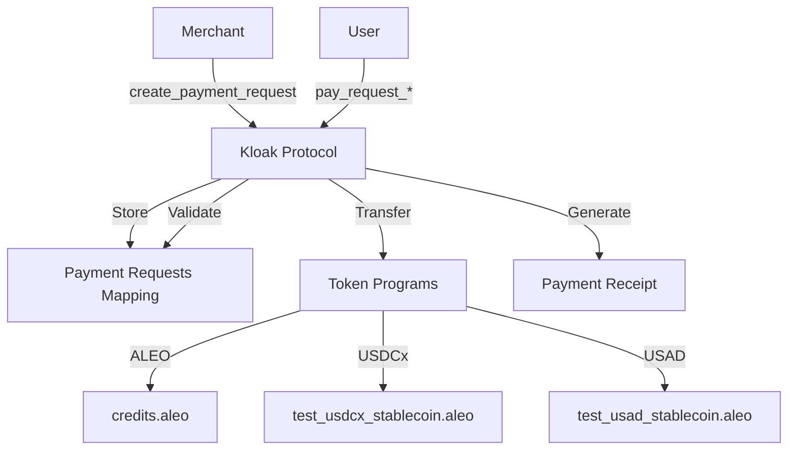

# Kloak Protocol v6.aleo

## Overview

The Kloak Protocol v6.aleo is a zero-knowledge smart contract deployed on the Aleo blockchain that enables private payment requests and transactions. It integrates support for three different tokens: Aleo's native credits (ALEO), and two stablecoins (USDCx and USAD), ensuring all transactions maintain user privacy through zero-knowledge proofs.

## Key Features

### Payment Request Creation
Merchants can create payment requests specifying:
- **Asset Type**: 0 for ALEO, 1 for USDCx, 2 for USAD
- **Amount**: Fixed or open (flexible) amount
- **Request ID**: Unique identifier for the request

Each request is stored on-chain and marked as active for processing.

### Payment Processing
Users can pay these requests privately using any of the three supported tokens:

- **ALEO Payments**: Direct private transfer from credits records
- **USDCx/USAD Payments**: Private transfers using respective stablecoin programs, including compliance checks and Merkle proofs

All payments generate receipts confirming transaction details.

### Token Integration
- **ALEO**: Native Aleo credits for seamless blockchain transactions
- **USDCx**: Test stablecoin program for USDC-like transactions
- **USAD**: Test stablecoin program for USD-like transactions

All tokens support private transfers with zero-knowledge proofs, ensuring transaction privacy.

## Architecture



## Program Structure

### Mappings
- `payment_requests`: Stores PaymentRequest structs by request ID
- `nullifiers`: Prevents double-spending in distributions
- `campaigns`: Campaign data (currently paused)
- `campaign_pool`: Campaign funds (currently paused)
- `campaign_creator`: Campaign ownership (currently paused)

### Structs
- `PaymentRequest`: Contains merchant address, asset type, amount, open amount flag, and active status
- `PaymentReceipt`: Records payment details
- `PaymentRequestReceipt`: Confirms payment request fulfillment

### Transitions
- `create_payment_request`: Creates a new payment request
- `pay_request_aleo/usdcx/usad`: Processes payments for respective tokens
- `send_private_payment_*`: Direct private payments (utility functions)

## Campaign Features (Paused)

The program includes structures for campaign creation and distribution using Merkle trees for privacy-preserving payouts. However, development on these features has been paused because Aleo programs cannot hold funds directly, which is required for escrow-based campaign distributions. This limitation prevents the implementation of fund-holding mechanisms necessary for campaign payouts.

## Technical Implementation

- **Zero-Knowledge Proofs**: Uses Aleo's ZKP system for private transactions
- **Merkle Proofs**: For verification in campaign distributions (depth 10)
- **Asynchronous Transitions**: Handles complex token transfers
- **Hash Functions**: BHP256 for commitments and proofs
- **Token Imports**: Integrates with credits.aleo and custom stablecoin programs

## Building and Deployment

### Prerequisites
- Aleo CLI installed
- Access to Aleo testnet or mainnet

### Build
```bash
cd programs/kloak_protocol
leo build
```

### Deploy
```bash
leo deploy
```

### Testing
```bash
leo test
```

## Integration with Frontend

The program integrates with the Next.js frontend through:
- Payment link creation via `create_payment_request`
- Payment processing via `pay_request_*` functions
- Receipt verification for UI updates

## Security Considerations

- All transactions are private by default
- Nullifiers prevent replay attacks
- Asset type validation ensures correct token usage
- Amount validation for fixed-amount requests

## Future Enhancements

- Resume campaign distribution features (requires protocol-level fund holding)
- Additional token integrations
- Enhanced privacy features
- Cross-chain capabilities</content>
<parameter name="filePath">c:\dev\buildathons\aleo-privacy-buildathon\Kloak\programs\README.md